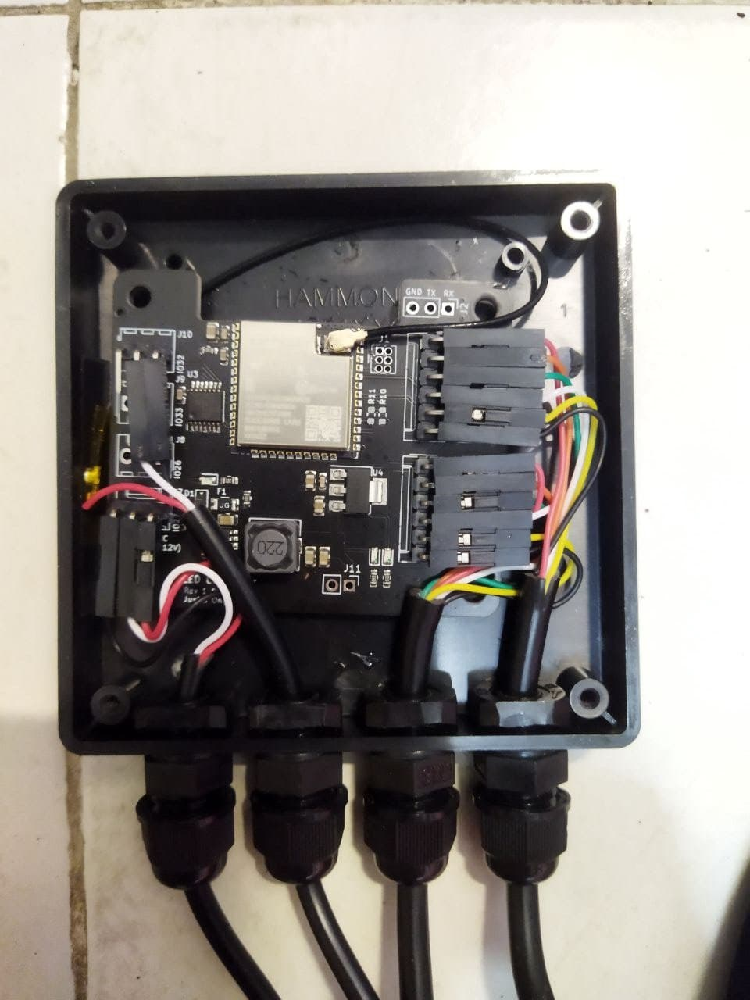
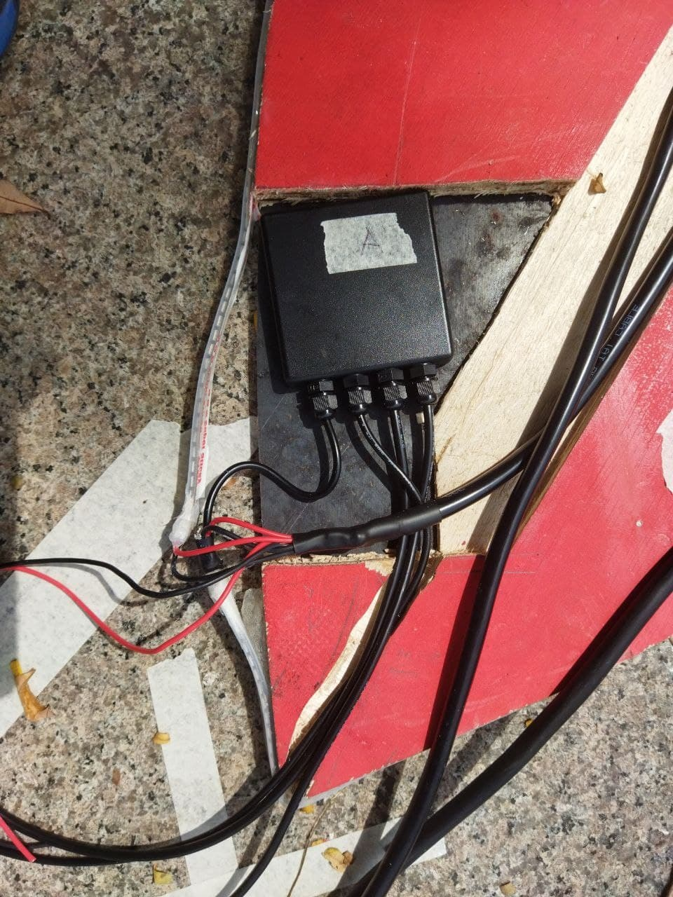
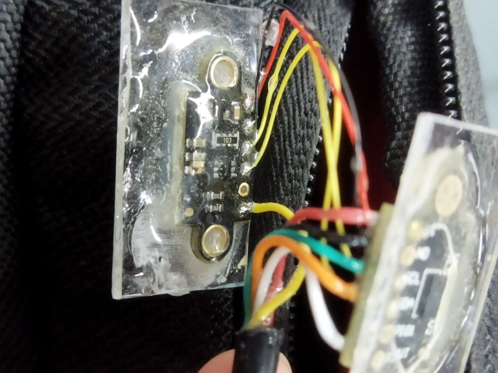
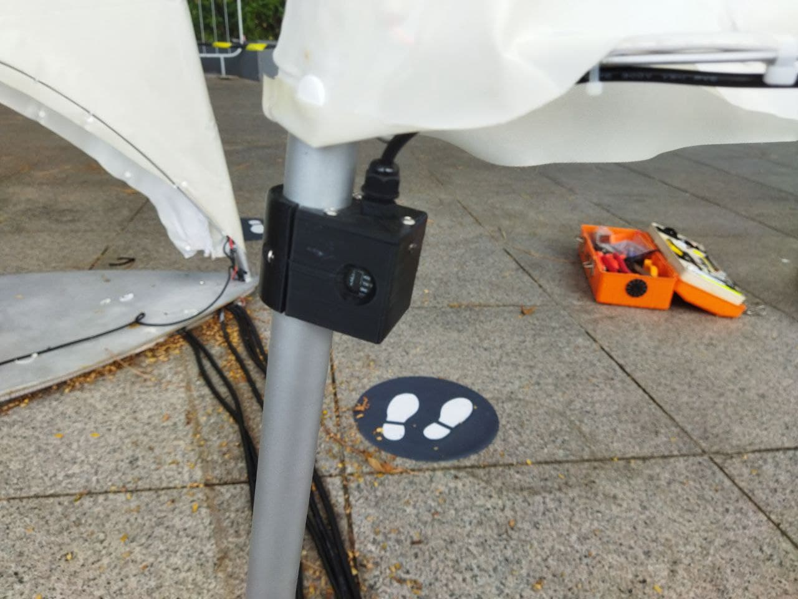

# LUMBA

This repository contains the source code for [LUMBA](https://curiocity.nlb.gov.sg/events/curiocity-showcase-2022/satellite#lumba), an art installation displayed at Esplanade Park as part of the Light to Night Festival 2022.

Each sail has an ESP32 mounted in the base to control the LEDs.

A set of sensors (VL53L0X) were mounted at the bottom of each sail for some audience interactivity. For crude waterproofing, the sensors were covered in epoxy since we wern't sure how waterproof the 3D-printed housings were.

Couple of interesting things I learnt:
- OTA (albeit with an external antenna) works even with the controller enclosure sandwiched by two metal plates
- Uploading bad firmware into a controller already mounted into the structure leads to some bad times
  - Probably a good idea to test on a separate unit before uploading
  - Possibility for more intelligent OTA handling? Say, "firmware must run for at least 60s before being marked ok"? This would limit the impact of bootloops
- Joining the LEDs and sensors with some form of connectors would have saved a lot of on-site work - even at the expense of the connectors being bulky/ugly
- _Some_ of the VL53L0X modules gave us huge headaches - the sensor readings were very noisy and required extremely aggressive filtering to prevent their range readings from jumping around. Unfortunately, we had way too many variables to definitively narrow down the cause (though after swapping out parts here and there, its likely 1 or 2):
  - Crosstalk from the acrylic plate
  - Faulty modules
  - Noise on the I2C lines
  - Environmental interference

Please excuse the spaghetti code - much of it was written at night/on-site to patch the odd bugs in the LED animation
